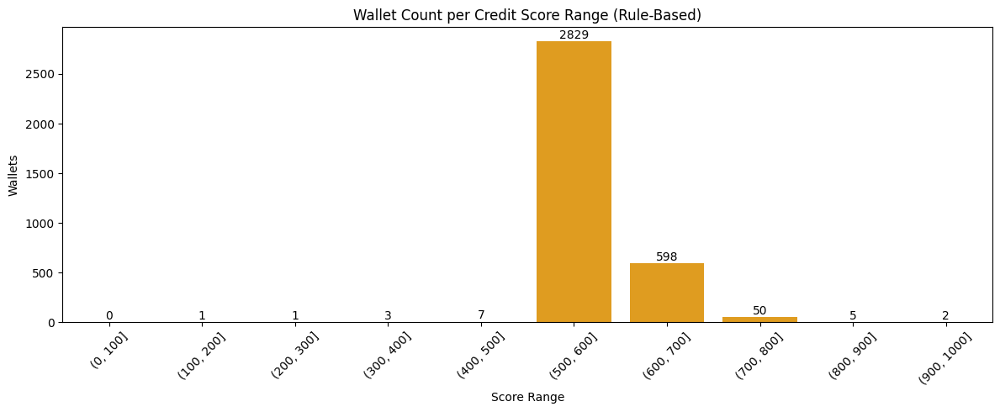
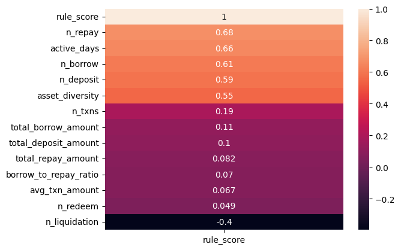

# 📊 Wallet Score Analysis (Aave V2 Protocol)

This report provides an analysis of the credit scores assigned to wallets based on their historical transaction behavior using the Aave V2 protocol data.

---

## 🧠 Scoring Method Recap

Each wallet is scored on a scale from **0 to 1000**, where:

- **Higher scores** → Indicate responsible and diverse DeFi usage
- **Lower scores** → Indicate risky, bot-like, or exploitative behavior

Score is computed using a **rule-based system** over engineered features including transaction frequency, volume, action diversity, borrowing behavior, liquidation risk, etc.

---

## 📈 Score Distribution

The following table shows how many wallets fall into each score range bucket:

| Score Range | Number of Wallets |
|-------------|-------------------|
| 0–100       |  0               |
| 100–200     |  1               |
| 200–300     |  1               |
| 300–400     |  3               |
| 400–500     |  7               |
| 500–600     | 2829               |
| 600–700     | 598               |
| 700–800     | 50               |
| 800–900     |  5               |
| 900–1000    |  2               |

> *(You can generate this table using the code provided below)*

---

## 🔍 Behavior of Wallets by Score

### 🟥 Low Score Wallets (0–200)
- Often perform **only one type of action** (e.g., repeated borrowing).
- Very **low transaction volume** or frequency.
- Appear to act **programmatically** or with exploitative patterns.
- Higher chance of being **liquidated** or **never repay borrowings**.

### 🟨 Mid Score Wallets (400–600)
- Perform both deposits and borrows, but lack consistent activity.
- Medium interaction count, but low diversity in actions.
- Some may show signs of risky behavior or inconsistencies.

### 🟩 High Score Wallets (800–1000)
- Consistent, **long-term usage** with multiple transaction types.
- Balanced mix of deposits, borrows, repayments.
- Rarely liquidated and show **responsible repayment behavior**.
- More trusted and stable usage pattern — likely real users or institutions.

---

## 📊 Score Distribution

## Each Feature contributions

